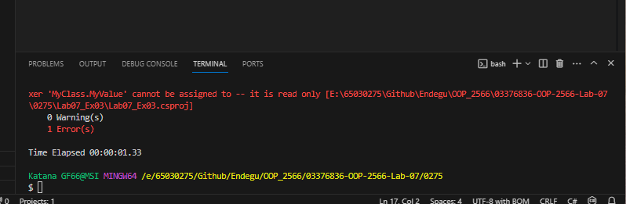
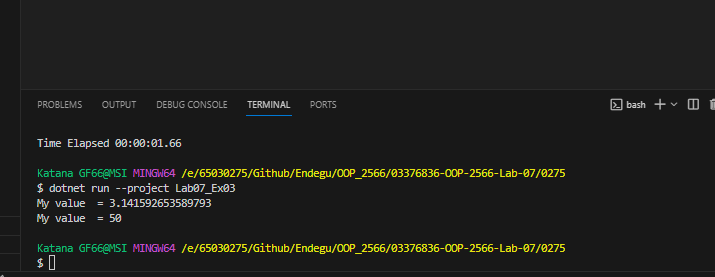

สร้างอ็อบเจกต์ mc ของคลาส MyClass
แสดงค่าของ MyValue ซึ่งเป็นค่าคงที่ My_PI ที่มีค่าเท่ากับ Math.PI
กำหนดค่า MyValue ของ mc เป็น 50 และแสดงค่า MyValue อีกครั้ง ซึ่งค่า MyValue ไม่เปลี่ยนแปลงเนื่องจากเป็นค่าคงที่