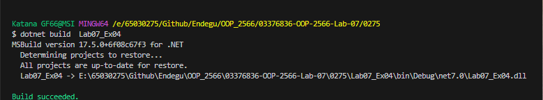

MyClass mc = new MyClass();
mc.MyValue = 50;
System.Console.WriteLine($"My value  = {mc.MyValue}");

class MyClass
{
    private int StoredValue;
    public int MyValue
    {
        get
        {
            return StoredValue;
        }
        set
        {
            StoredValue = value;
        }
    }
}

สร้างอ็อบเจกต์ mc ของคลาส MyClass
กำหนดค่า MyValue ของ mc เป็น 50
แสดงค่า MyValue ซึ่งจะส่งคืนค่าที่อ่านได้จากตัวแปร StoredValue